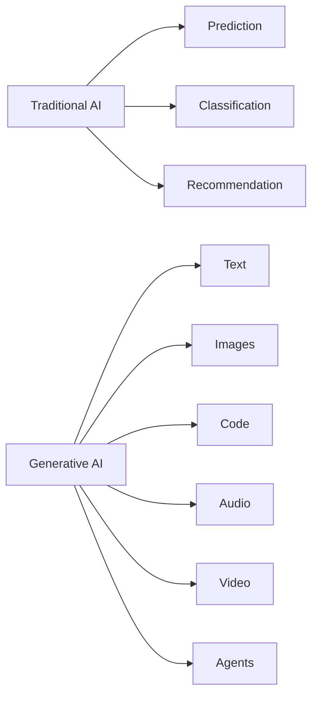
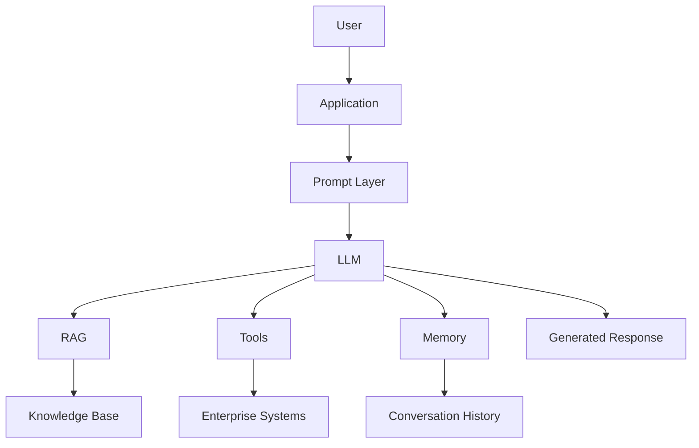

# Generative AI

> **"Generative AI represents one of the biggest shifts in software since the introduction of the internet and smartphones. Instead of simply processing information, software can now generate new content, reason through problems, and collaborate with users."**

Generative AI (GenAI) has transformed how products are designed, built, and experienced. Applications such as ChatGPT, Claude, GitHub Copilot, and Notion AI have demonstrated that AI is no longer just a backend capability—it has become the user experience itself.

For AI Product Managers, understanding Generative AI is no longer optional. It is the foundation for building intelligent assistants, enterprise copilots, content generation tools, recommendation systems, and autonomous AI agents.

---

# What is Generative AI?

Generative AI is a class of Artificial Intelligence capable of creating **new content** rather than simply analyzing or classifying existing data.

Depending on the model, it can generate:

- Text
- Images
- Audio
- Video
- Code
- Documents
- Presentations
- Structured Data
- Software Workflows

Unlike traditional AI systems that answer **"What is this?"**, Generative AI answers:

> **"Create something new."**

---

## Traditional AI vs Generative AI

| Traditional AI | Generative AI |
|----------------|---------------|
| Predicts outcomes | Creates new content |
| Classifies data | Generates text, images, code, audio, and video |
| Uses structured data | Uses structured and unstructured data |
| Often invisible to users | Frequently becomes the user interface |
| Optimizes existing workflows | Enables entirely new workflows |

---



---

# Why Generative AI Changed Software

Historically, software required users to learn the interface.

Generative AI changes this relationship.

Instead of navigating menus, users describe what they want in natural language.

Examples:

Traditional Software:

```
Click

Select

Configure

Export
```

Generative AI:

```
"Summarize this report."

"Generate next week's sales forecast."

"Create a product roadmap."

"Draft a customer email."
```

Natural language becomes the new interface.

---

# How Generative AI Works

Although the underlying technology is complex, the high-level workflow is straightforward.


Many enterprise products extend this flow with Retrieval-Augmented Generation (RAG), tools, APIs, memory, and AI agents.

---

# Foundation Models

Most modern Generative AI applications are built on **Foundation Models**.

Examples include:

- GPT-5
- Claude
- Gemini
- Llama
- Mistral
- Qwen

These models have been pretrained on vast amounts of data and can be adapted to many use cases through prompting, retrieval, or fine-tuning.

As an AI Product Manager, your job is rarely to build a foundation model—you choose the right one for your product.

---

# Types of Generative AI

Generative AI extends far beyond chatbots.

| Type | Example Output |
|------|----------------|
| Text Generation | Articles, emails, reports |
| Image Generation | Marketing assets, illustrations |
| Code Generation | Software, SQL, scripts |
| Audio Generation | Voice assistants, narration |
| Video Generation | Training videos, advertisements |
| Structured Output | JSON, XML, workflows |
| Multi-Agent Systems | Autonomous task execution |

---

# Generative AI Product Architecture

Most AI-powered products follow a similar architecture.



This architecture is explored in more detail in later chapters on RAG, AI Agents, and MCP.

---

# Common Product Patterns

Generative AI appears in products through recurring patterns.

### AI Assistant

Answers questions and assists users.

Examples:

- ChatGPT
- Claude
- Enterprise Help Desks

---

### Copilot

Supports users while they perform existing tasks.

Examples:

- GitHub Copilot
- Microsoft 365 Copilot

---

### Content Generator

Creates documents, presentations, emails, or marketing content.

---

### Enterprise Search

Uses RAG to retrieve internal company knowledge before generating responses.

---

### Workflow Automation

Combines AI with tools and APIs to automate multi-step business processes.

---

### AI Agent

Reasons, plans, uses tools, and executes tasks autonomously.

---

# Product Opportunities

Generative AI creates opportunities across nearly every industry.

Examples include:

| Industry | Opportunity |
|-----------|-------------|
| Healthcare | Clinical documentation |
| Finance | Risk analysis |
| Manufacturing | Maintenance assistants |
| HR | Employee copilots |
| Legal | Contract summarization |
| CRM | Sales assistants |
| ERP | Intelligent workflow automation |
| Education | Personalized tutoring |

Notice that the opportunity is rarely "adding a chatbot." It is redesigning workflows around intelligent assistance.

---

# Product Challenges

Generative AI also introduces new risks.

- Hallucinations
- Bias
- Prompt Injection
- Privacy concerns
- Copyright issues
- Cost of inference
- Latency
- Evaluation complexity
- Trust
- Security

AI Product Managers must balance innovation with reliability.

---

# AI PM Decision Framework

Before adding Generative AI to a product, ask:

1. Does AI solve a real customer problem?
2. Is high-quality data available?
3. Which model best fits the use case?
4. What level of accuracy is required?
5. What happens if the AI is wrong?
6. Can users verify the output?
7. How will success be measured?
8. What are the operational costs?
9. Does the experience build user trust?
10. Is AI the simplest solution?

These questions often determine whether an AI feature succeeds or fails.

---

# Common Misconceptions

❌ Generative AI is only for chatbots.

Reality:

Generative AI powers search, automation, copilots, analytics, document generation, coding assistants, and much more.

---

❌ Bigger models are always better.

Reality:

The best model is the one that meets your product's requirements for quality, speed, cost, privacy, and reliability.

---

❌ AI replaces Product Managers.

Reality:

AI changes how Product Managers work, but product strategy, customer understanding, prioritization, and decision-making remain fundamentally human responsibilities.

---

# Key Takeaways

✅ Generative AI creates new content rather than simply analyzing existing information.

✅ Natural language is becoming a primary user interface for modern software.

✅ Foundation Models power most Generative AI products.

✅ AI Product Managers focus on selecting models, designing user experiences, measuring outcomes, and managing risk—not building models from scratch.

✅ Successful AI products combine Generative AI with retrieval, tools, memory, and strong product thinking.

---

# Reflection Questions

1. Which Generative AI products do you use most frequently?
2. How has Generative AI changed the user experience compared to traditional software?
3. Can you identify a workflow in your organization that could be redesigned using Generative AI?
4. What risks would you need to manage before launching such a product?

---

# Practical Exercise

Choose a product you use regularly (for example, your CRM, ERP, or documentation platform).

Design one Generative AI feature that would create meaningful value for users.

For your proposal, answer:

- What problem does it solve?
- Why is Generative AI the right solution?
- Which type of model would you use?
- What data would the model need?
- How would you measure success?
- What risks would you need to mitigate?

---

### Product Manager's Checklist

Before proposing a Generative AI feature, ask yourself:

- [ ] Does this solve a real customer problem?
- [ ] Is Generative AI necessary, or would deterministic logic be simpler?
- [ ] What happens when the AI is wrong?
- [ ] Can users verify or edit the output?
- [ ] Have privacy and security been considered?
- [ ] Is the response grounded in trusted data?
- [ ] Are latency and cost acceptable?
- [ ] How will we measure success after launch?
