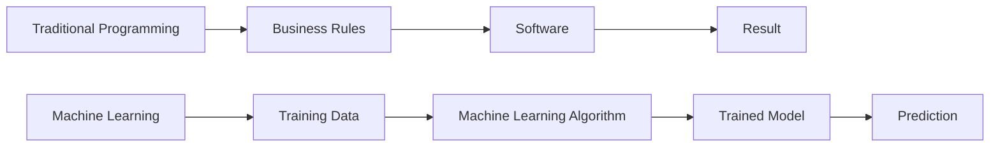

# Machine Learning

> **"Machine Learning is not about replacing software with intelligence. It's about enabling software to improve its behavior by learning from data rather than relying solely on manually written rules."**

Machine Learning (ML) is one of the foundational technologies behind modern Artificial Intelligence. It powers recommendation systems, fraud detection, autonomous vehicles, speech recognition, predictive analytics, and—most recently—Large Language Models (LLMs).

As an AI Product Manager, you don't need to build machine learning models yourself. However, understanding how Machine Learning works is essential for making informed product decisions, collaborating with technical teams, and identifying where AI can create real customer value.

---

# What is Machine Learning?

Machine Learning is a branch of Artificial Intelligence that enables computers to learn patterns from data and make predictions or decisions without being explicitly programmed for every possible scenario.

Traditional software follows predefined rules written by developers.

Machine Learning systems learn these rules automatically by analyzing historical data.

For example:

Instead of writing hundreds of rules to identify spam emails, a Machine Learning model learns the characteristics of spam by analyzing millions of previously labeled emails.

---

## Traditional Programming vs Machine Learning

Traditional software follows this process:

```text
Rules + Data
        ↓
    Program
        ↓
     Output
```

Machine Learning reverses the process.

```text
Historical Data + Correct Answers
                ↓
        Machine Learning
                ↓
            Model
                ↓
         New Data → Prediction
```

---



---

# Why Machine Learning Matters for Product Managers

Machine Learning changes how products are designed.

Instead of defining every business rule manually, Product Managers define:

- The customer problem
- The desired business outcome
- Success metrics
- Data requirements
- Evaluation criteria

This requires a shift in thinking.

Rather than asking:

> "Which rules should we build?"

You begin asking:

> "Can the model learn this behavior from data?"

---

# A Simple Analogy

Imagine teaching a child to recognize dogs.

Traditional programming would require writing hundreds of rules.

```
Four legs

Has fur

Has a tail

Barks

Size

Ear shape

Eye color

Breed
```

This quickly becomes impossible.

Machine Learning takes a different approach.

Instead of writing rules, you show thousands of examples.

Eventually, the child learns the concept of "dog."

Machine Learning works in a very similar way.

---

# How Machine Learning Works

Most Machine Learning systems follow four basic steps.


Each stage requires product decisions.

---

## Step 1 — Collect Data

Every Machine Learning model begins with data.

Examples include:

- Customer transactions
- Images
- Documents
- Audio
- Sensor data
- User behavior
- CRM records

Poor-quality data almost always leads to poor-quality predictions.

---

## Step 2 — Train

The model analyzes historical data and identifies patterns.

It does **not** memorize individual examples (ideally).

Instead, it learns statistical relationships.

---

## Step 3 — Evaluate

Before deployment, the model must be tested.

Evaluation often includes metrics such as:

- Accuracy
- Precision
- Recall
- F1 Score

Unlike traditional software, AI is rarely "100% correct."

The goal is to achieve acceptable performance for the business context.

---

## Step 4 — Deploy

The trained model becomes part of a real product.

Examples:

- Fraud detection
- Product recommendations
- Search ranking
- Email classification

---

## Step 5 — Monitor

Machine Learning products continue changing after launch.

Product teams monitor:

- Accuracy
- Latency
- Cost
- Drift
- User satisfaction

Deployment is the beginning—not the end.

---

# Types of Machine Learning

There are three major categories every AI Product Manager should know.

---

## Supervised Learning

The model learns from labeled examples.

Example:

```
Email

↓

Spam or Not Spam
```

Common use cases:

- Fraud detection
- Medical diagnosis
- Demand forecasting
- Customer churn prediction

---

## Unsupervised Learning

The model discovers hidden patterns without labeled data.

Examples:

- Customer segmentation
- Topic clustering
- Anomaly detection

---

## Reinforcement Learning

The model learns by interacting with an environment and receiving rewards or penalties.

Examples:

- Robotics
- Autonomous vehicles
- Game-playing AI
- Recommendation optimization

---

# Common Machine Learning Models

You don't need to know how these work mathematically, but you should recognize their names.

| Model | Typical Use |
|---------|-------------|
| Linear Regression | Forecasting |
| Logistic Regression | Classification |
| Decision Trees | Decision Making |
| Random Forest | Classification & Regression |
| Gradient Boosting | Structured Data Prediction |
| Neural Networks | Complex Pattern Recognition |
| Transformers | Large Language Models |
| Clustering Algorithms | Customer Segmentation |

---

# Real Product Examples

Machine Learning powers many products you use every day.

| Product | ML Application |
|----------|----------------|
| Netflix | Movie recommendations |
| Spotify | Music recommendations |
| Amazon | Product recommendations |
| Gmail | Spam detection |
| Google Maps | Traffic prediction |
| Uber | ETA estimation |
| LinkedIn | Job recommendations |
| ChatGPT | Language generation |

Notice that users rarely interact with "Machine Learning."

They interact with products that become more useful because of it.

---

# Common Challenges

Machine Learning is powerful, but it isn't magic.

Some common challenges include:

- Poor-quality data
- Biased datasets
- Model drift
- High infrastructure costs
- Explainability
- Privacy concerns
- Hallucinations (for generative models)
- Regulatory compliance

Understanding these challenges helps Product Managers make better strategic decisions.

---

# When NOT to Use Machine Learning

One of the most valuable skills of an AI Product Manager is recognizing when Machine Learning is unnecessary.

Avoid ML when:

- A simple business rule solves the problem.
- There isn't enough reliable data.
- The cost outweighs the value.
- Explainability is legally required.
- Accuracy requirements are extremely high and deterministic logic is sufficient.

Remember:

> **Just because AI can solve a problem doesn't mean it should.**

---

# Key Takeaways

✅ Machine Learning enables systems to learn patterns from data instead of relying on manually written rules.

✅ Product Managers should understand Machine Learning concepts even if they never build models themselves.

✅ Data quality often has a greater impact on performance than algorithm complexity.

✅ AI products require continuous monitoring after launch.

✅ The best AI Product Managers know when Machine Learning is—and isn't—the right solution.

---

# Reflection Questions

1. What products do you use daily that rely on Machine Learning?
2. Can you identify a business problem where simple rules would outperform Machine Learning?
3. Why is data quality often more important than choosing a sophisticated algorithm?
4. How would you explain Machine Learning to a non-technical stakeholder?

---

# Practical Exercise

Choose a product you know well (such as Spotify, Amazon, Netflix, or your own company's product).

For each feature below, decide whether it is best implemented using traditional software rules or Machine Learning:

- Search
- Product recommendations
- Spam detection
- Login authentication
- Fraud detection
- Personalized notifications

Explain your reasoning for each decision.
