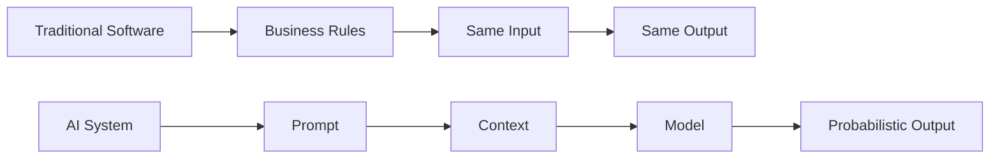

# Difference Between a Traditional Product Manager and an AI Product Manager

Artificial Intelligence is changing how products are built, delivered, and experienced. While many of the core principles of Product Management remain the same, AI introduces new challenges, responsibilities, and ways of thinking that fundamentally change the role of a Product Manager.

A traditional Product Manager focuses on delivering deterministic software-systems that behave predictably according to predefined business rules. An AI Product Manager, on the other hand, works with probabilistic systems whose outputs may vary, learn from data, and continuously evolve.

Understanding these differences is essential for anyone transitioning into AI Product Management.

---

## At a Glance

| Traditional Product Manager | AI Product Manager |
|-----------------------------|-------------------|
| Builds deterministic software | Builds intelligent systems |
| Defines business requirements | Defines AI capabilities and business outcomes |
| Works primarily with Engineering and Design | Works with Engineering, Design, Data Science, AI Engineers, and ML Engineers |
| Success measured by product KPIs | Success measured by both business KPIs and AI performance |
| Features are rule-based | Features are probabilistic and data-driven |
| Software behavior is predictable | AI behavior is probabilistic and requires evaluation |
| Releases are version-based | AI systems evolve continuously through models, prompts, and data |
| Focuses on usability | Focuses on usability, trust, explainability, and safety |

---

## The Fundamental Difference

Traditional software answers questions like:

> "What should the software do?"

AI products answer a different question:

> "What should the AI be capable of?"

This small shift changes almost every aspect of Product Management.

Instead of defining every business rule, AI Product Managers define outcomes, constraints, context, and evaluation criteria.

---

## Traditional Products Follow Rules

Imagine you're building an expense management application.

Business Rule:

```
If the expense is greater than $500,
send it for manager approval.
```

Every time this rule executes, the result is identical.

The Product Manager spends most of their time defining workflows, permissions, edge cases, and business logic.

The software either works or it doesn't.

---

## AI Products Make Decisions

Now imagine you're building an AI Expense Assistant.

Instead of defining explicit rules, you ask the AI to:

- Categorize expenses
- Detect fraud
- Summarize receipts
- Recommend approvals
- Answer employee questions

The AI will not always produce the exact same answer.

Its responses depend on:

- Context
- Prompt design
- Retrieved information
- Model capabilities
- Temperature
- User intent

Instead of managing business rules, the Product Manager manages uncertainty.

---

## Deterministic vs Probabilistic Systems



Traditional software is deterministic.

AI software is probabilistic.

This is the biggest conceptual shift.

---

# Responsibilities Comparison

| Responsibility | Traditional PM | AI PM |
|----------------|---------------|--------|
| Product Vision | ✅ | ✅ |
| Roadmap | ✅ | ✅ |
| User Research | ✅ | ✅ |
| Feature Prioritization | ✅ | ✅ |
| Sprint Planning | ✅ | ✅ |
| Product Analytics | ✅ | ✅ |
| Prompt Design | ❌ | ✅ |
| Model Selection | ❌ | ✅ |
| AI Evaluation | ❌ | ✅ |
| RAG Strategy | ❌ | ✅ |
| Agent Design | ❌ | ✅ |
| AI Safety | ❌ | ✅ |
| Hallucination Reduction | ❌ | ✅ |
| AI Governance | ❌ | ✅ |

---

# Team Collaboration

Traditional Product Managers typically work with:

- Software Engineers
- Designers
- QA Engineers
- Business Stakeholders

AI Product Managers often collaborate with additional specialists:

- AI Engineers
- Machine Learning Engineers
- Data Scientists
- Prompt Engineers
- MLOps Engineers
- Data Engineers
- Security Teams
- Legal & Compliance Teams

AI introduces more disciplines into the product development process.

---

# Product Discovery Changes

Traditional Product Discovery asks:

- What problem are we solving?
- Who is the customer?
- Which features should we build?

AI Product Discovery asks additional questions:

- Does AI actually solve this problem?
- Is enough high-quality data available?
- Which model should we use?
- Can users trust the output?
- How will we evaluate accuracy?
- What happens when the AI is wrong?
- How much will inference cost?

Choosing AI simply because it's trendy rarely creates a successful product.

---

# New Success Metrics

Traditional products focus on metrics such as:

- Revenue
- Conversion Rate
- Retention
- DAU/MAU
- Customer Satisfaction

AI Products require additional technical metrics.

Examples include:

| Business Metrics | AI Metrics |
|------------------|------------|
| Revenue | Accuracy |
| Retention | Precision |
| Conversion | Recall |
| Churn | Hallucination Rate |
| NPS | Response Quality |
| Engagement | Groundedness |
| Adoption | Latency |
| Customer Satisfaction | Cost per Request |

An AI Product Manager must understand both worlds.

---

# The AI Product Lifecycle

Traditional Software

```
Discover

↓

Design

↓

Develop

↓

Test

↓

Release

↓

Maintain
```

AI Products

```
Discover

↓

Collect Data

↓

Choose Model

↓

Prompt Design

↓

Prototype

↓

Evaluate

↓

Improve

↓

Deploy

↓

Monitor

↓

Retrain / Update

↓

Repeat
```

AI products are never truly finished.

---

# Risk Management

Traditional software risks include:

- Bugs
- Performance issues
- Downtime
- Security vulnerabilities

AI introduces additional risks:

- Hallucinations
- Bias
- Toxic outputs
- Prompt Injection
- Privacy leakage
- Copyright issues
- Model drift
- High inference costs
- Data quality problems

Managing these risks becomes part of the Product Manager's role.

---

# Decision Making

Traditional PM decisions:

- Which feature should we build?
- How should the workflow behave?
- Which user segment should we prioritize?

AI PM decisions:

- Should we use AI at all?
- Which model best fits the use case?
- Should we fine-tune or use prompting?
- Do we need Retrieval-Augmented Generation (RAG)?
- Should we build an AI Agent or a chatbot?
- How much latency is acceptable?
- How should we evaluate output quality?
- What level of explainability is required?

---

# Mindset Shift

Perhaps the biggest change isn't technical-it's mental.

Traditional Product Managers seek certainty.

AI Product Managers learn to manage uncertainty.

Instead of asking:

> "Will this feature work?"

They ask:

> "How well does this feature work, and under what conditions?"

That mindset is the foundation of successful AI Product Management.

---

# Key Takeaways

✅ Product Management principles remain the foundation of AI Product Management.

✅ AI Product Managers need enough technical understanding to make informed product decisions-not to build machine learning models themselves.

✅ AI products require continuous evaluation, monitoring, and improvement rather than one-time releases.

✅ Success depends on balancing user value, business outcomes, technical feasibility, and responsible AI practices.
