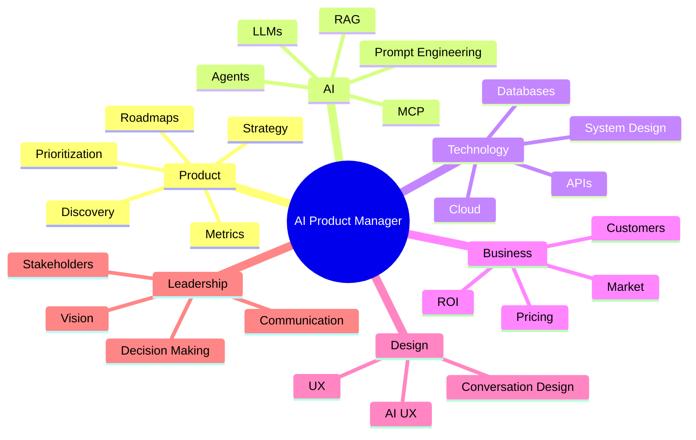

# Skills Required to Become an AI Product Manager

Artificial Intelligence is changing Product Management faster than almost any other technology in recent history.

Unlike traditional Product Managers, AI Product Managers must navigate both the business and technical worlds. They don't need to become Machine Learning Engineers, but they must understand enough to make informed product decisions, communicate effectively with technical teams, and deliver AI products that create real customer value.

The best AI Product Managers combine strategic thinking, technical understanding, user empathy, experimentation, and leadership.

This chapter outlines the essential skills every AI Product Manager should develop.

---

# The AI Product Manager Skill Map

No single person is expected to master every area.

The goal is to understand enough to make excellent product decisions.

---

# Skill Categories

An AI Product Manager needs skills across six major domains.

| Domain | Importance |
|---------|------------|
| Product Management | ⭐⭐⭐⭐⭐ |
| Artificial Intelligence | ⭐⭐⭐⭐⭐ |
| Technical Knowledge | ⭐⭐⭐⭐ |
| Business Strategy | ⭐⭐⭐⭐⭐ |
| Design & User Experience | ⭐⭐⭐⭐ |
| Leadership & Communication | ⭐⭐⭐⭐⭐ |

Each domain supports the others.

---

# 1. Product Management

Everything begins with Product Management.

AI is simply another way of delivering customer value.

Without strong product fundamentals, AI becomes an expensive technology experiment.

## Core Skills

- Product Discovery
- Customer Research
- Problem Framing
- Product Strategy
- Product Vision
- Roadmapping
- Prioritization
- MVP Definition
- Product Metrics
- Experimentation
- Agile Methodologies
- Stakeholder Management

### Required Level

🟠 Practical

You should be comfortable leading an entire product lifecycle.

---

# 2. Artificial Intelligence Fundamentals

You don't need to build models.

You do need to understand how AI works well enough to make product decisions.

## Topics

- Machine Learning
- Deep Learning
- Generative AI
- Large Language Models (LLMs)
- Embeddings
- Vector Databases
- Retrieval-Augmented Generation (RAG)
- AI Agents
- Model Context Protocol (MCP)
- Prompt Engineering
- Fine-Tuning
- AI Evaluation

### Required Level

🔵 Working Knowledge

For Prompt Engineering and RAG:

🟠 Practical

---

# 3. Technical Skills

AI Product Managers work closely with engineers every day.

Understanding technical concepts allows better communication and better decision-making.

## Important Topics

- APIs
- REST
- JSON
- Authentication
- Databases
- Cloud Platforms
- Docker
- Git & GitHub
- System Architecture
- Event-Driven Systems
- Microservices

Do you need to code?

No.

Should you understand how software is built?

Absolutely.

### Required Level

🔵 Working Knowledge

---

# 4. Data Literacy

Every AI product depends on data.

Poor data leads to poor AI.

AI Product Managers should understand:

- Structured vs Unstructured Data
- Data Quality
- Labels
- Metadata
- Data Pipelines
- Data Privacy
- Data Governance

Questions you should ask:

- Where does the data come from?
- Is it trustworthy?
- Is it complete?
- Is it biased?

### Required Level

🔵 Working Knowledge

---

# 5. Prompt Engineering

Prompt Engineering is becoming one of the core skills of modern AI Product Managers.

You should know how to:

- Write effective prompts
- Structure context
- Reduce hallucinations
- Create reusable prompt templates
- Evaluate prompt quality
- Design system prompts
- Use structured outputs
- Test prompts

### Required Level

🟠 Practical

---

# 6. Retrieval-Augmented Generation (RAG)

Many enterprise AI applications rely on RAG.

Understanding RAG is no longer optional.

Topics include:

- Chunking
- Embeddings
- Vector Search
- Hybrid Search
- Metadata
- Re-ranking
- Retrieval Evaluation
- Grounding

### Required Level

🟠 Practical

---

# 7. AI Agents

AI is moving beyond chatbots.

Modern AI systems increasingly rely on autonomous agents.

You should understand:

- Single-Agent Systems
- Multi-Agent Systems
- Planning
- Tool Calling
- Memory
- Agent Orchestration
- Human-in-the-Loop
- Agent Evaluation

### Required Level

🔵 Working Knowledge

---

# 8. AI User Experience (AI UX)

Designing AI products is different from designing traditional software.

Important concepts include:

- Conversational Interfaces
- Explainability
- Trust
- Transparency
- Error Recovery
- Human Oversight
- Confidence Indicators
- Feedback Loops

Users must understand what the AI can and cannot do.

### Required Level

🟠 Practical

---

# 9. Business Skills

Technology alone doesn't create successful products.

AI Product Managers must understand:

- Market Analysis
- Competitive Research
- Pricing Models
- Cost Management
- ROI
- Product-Market Fit
- Customer Segmentation
- Go-to-Market Strategy

One additional challenge in AI products is balancing customer value with inference costs.

### Required Level

🟠 Practical

---

# 10. Metrics and Evaluation

Traditional product metrics are not enough.

AI products require two sets of measurements.

## Business Metrics

- Revenue
- Adoption
- Retention
- Engagement
- NPS
- Conversion

## AI Metrics

- Accuracy
- Precision
- Recall
- Hallucination Rate
- Latency
- Cost per Request
- Response Quality
- Groundedness

### Required Level

🔵 Working Knowledge

---

# 11. Leadership Skills

Great AI Product Managers influence without authority.

Essential leadership skills include:

- Communication
- Decision Making
- Prioritization
- Negotiation
- Facilitation
- Strategic Thinking
- Conflict Resolution
- Executive Communication

These become even more important when coordinating Engineering, Data Science, Design, Security, Legal, and Business teams.

### Required Level

🟠 Practical

---

# 12. Responsible AI

AI Product Managers have a responsibility to build trustworthy systems.

Topics include:

- Fairness
- Bias
- Explainability
- Privacy
- Security
- Compliance
- AI Governance
- Human Oversight

Responsible AI should be considered throughout the product lifecycle, not added at the end.

### Required Level

🔵 Working Knowledge

---

# Do AI Product Managers Need to Code?

This is one of the most common questions.

The short answer is:

No.

The better answer is:

You don't need to become a software engineer, but you should understand enough technical concepts to collaborate effectively with engineering teams and make informed product decisions.

Many successful AI Product Managers write small scripts, prototype ideas, or explore APIs, but their primary role remains product leadership-not software development.

---

# Learning Priorities

If you're just getting started, focus on learning in this order:

1. Product Management Fundamentals
2. AI Fundamentals
3. Large Language Models
4. Prompt Engineering
5. APIs & System Architecture
6. Retrieval-Augmented Generation (RAG)
7. AI Agents
8. AI UX
9. Business Strategy
10. Responsible AI

Each layer builds on the previous one.

---

# Skill Progression

Learning AI Product Management is a journey, not a checklist.

---

# Key Takeaways

✅ Strong Product Management skills remain your foundation.

✅ Understand AI deeply enough to make product decisions, not necessarily to build models.

✅ Develop practical skills in Prompt Engineering and RAG.

✅ Learn to measure both business outcomes and AI performance.

✅ Build communication and leadership skills alongside technical knowledge.

✅ Never stop learning-AI evolves rapidly, and great AI Product Managers evolve with it.

---

# Reflection Questions

- Which skill category is your strongest today?
- Which area represents your biggest learning opportunity?
- How comfortable are you discussing AI concepts with engineers?
- If you were asked to launch an AI product tomorrow, which skills would you rely on most?

---

# Practical Exercise

Create your own AI Product Manager Skill Matrix.

For each skill in this chapter, rate yourself from 1 (Beginner) to 5 (Advanced).

Identify your top three strengths and your top three areas for improvement. Use these insights to build a personalized learning roadmap.
